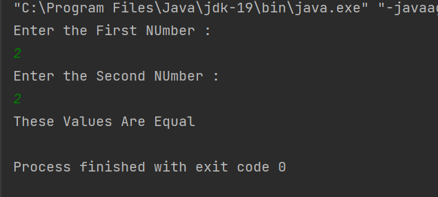

# SLACK---ASSIGNMENT---01
BASIC - JAVA PROGRAMS

<<<<<<< HEAD
## REGISTER NUMBER : 212221240029
## NAME : Monisha T

### 1) Write a Java program to print the sum, multiply, subtract, divide and remainder of two numbers

```python

import java.util.Scanner;
public class Main
{
   public static void main(String[] args) {
       Scanner sc=new Scanner(System.in);
       System.out.println("Enter the First NUmber : ");
       int num = sc.nextInt();
       System.out.println("Enter the Second NUmber : ");
       int num1 = sc.nextInt();
       int sum =num+num1;
       int minus = num-num1;
       int multiply = num*num1;
       int div = num/num1;
       System.out.println("Addition = "  + sum);
       System.out.println("Difference = "  + minus);
       System.out.println("Multiplication = "  + multiply);
       System.out.println("Division = "  + div);
   }
}

```
### OUTPUT


### 2) Write a Java program to compare two numbers

```python


import java.util.Scanner;
public class Main
{
   public static void main(String[] args) {
       Scanner sc=new Scanner(System.in);
       System.out.println("Enter the First NUmber : ");
       int num = sc.nextInt();
       System.out.println("Enter the Second NUmber : ");
       int num1 = sc.nextInt();
       if(num==num1)
       {
           System.out.println("These Values Are Equal");
       }
       else
       {
           System.out.println("These Values Are Not Equal");
       }
   }
}

```
### OUTPUT



### 3) Write a Java program to convert a string to an integer

```python

import java.util.Scanner;
public class Main
{
    public static void main(String[] args)
    {
        Scanner input=new Scanner(System.in);
        System.out.print("Enter the string: ");
        String str=input.nextLine();
        int num=Integer.parseInt(str);
        System.out.println("The number is: "+num);
    }
}

```
### OUTPUT


### 4) Java Program to find area of rhombus

```python

import java.util.Scanner;
public class Main
{
   public static void main(String[] args) {
       Scanner sc=new Scanner(System.in);
       System.out.println("Enter the First NUmber : ");
       int num = sc.nextInt();
       System.out.println("Enter the Second NUmber : ");
       int num1 = sc.nextInt();
       float area = (num*num1)/2;
       System.out.println("Area of Rhombus : " + area);
   }
}

```

### OUTPUT


### 5) Write a Java program to find the number of days in a month

```python

import java.util.Scanner;
public class Main
{
   public static void main(String[] args) {
       Scanner sc = new Scanner(System.in);
       System.out.println("Enter the Month : ");
       int month = sc.nextInt();
       System.out.println("Enter the Year : ");
       int year = sc.nextInt();
       if((month==2) && ((year%4==0) || ((year%100==0)&&(year%400==0))))
           System.out.println("Number of days is 29");


       else if(month==2)
           System.out.println("Number of days is 28");


       else if(month==1 || month==3 || month==5 || month==7 || month==8 || month==10 || month==12)
           System.out.println("Number of days is 31");


       else
           System.out.println("Number of days is 30");
   }

```
### OUTPUT


### 6) Write a Java program to print the even numbers from 1 to 20

```python

public class Main
{
   public static void main(String[] args) {
       for(int i=1;i<=20;i++)
       {
           if(i%2==0)
           {
               System.out.print(" " + i );
           }
       }
   }
}

```
### OUTPUT


### 7)  Write a Java program to create a simple calculator

```python

import java.util.Scanner;
public class Main
{
   public static void main(String[] args) {
       Scanner sc = new Scanner(System.in);
       System.out.println("Enter the Operator : ");
       char op = sc.next().charAt(0);
       System.out.println("Enter the First Number : ");
       int num = sc.nextInt();
       System.out.println("Enter the Second Number : ");
       int num1 = sc.nextInt();
       int result;
       switch(op)
       {
           case '+':
               result = num+num1;
               System.out.println("Addition of num + num1 = " + result );
               break;
           case '-':
               result=num-num1;
               System.out.println("Difference of num - num1 = " + result );
               break;
           case '*':
               result=num*num1;
               System.out.println("Multiplication  of num * num1 = " + result );
               break;
           case '/':
               result=num/num1;
               System.out.println("Division of num / num1 = " + result );
               break;
           default:
               System.out.println("Invalid operator!");
               break;
       }


   }
}

```
### OUTPUT


### 8) Write a Java program to print multiplication table of given number

```python

import java.util.Scanner;
public class Main
{
   public static void main(String[] args) {
       Scanner sc = new Scanner(System.in);
       System.out.println("Enter the Number : ");
       int num = sc.nextInt();
       for(int i=1;i<=10;i++)
       {
           System.out.println(num+" * "+i+" = "+num*i);
       }


   }
}

```
### OUTPUT

=======
>>>>>>> c15616db0f5a0dddaf6d891b6da72a0c1aeb7e72
